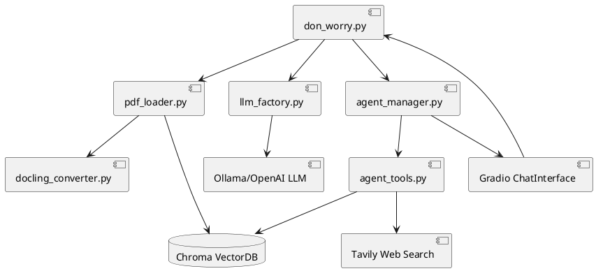
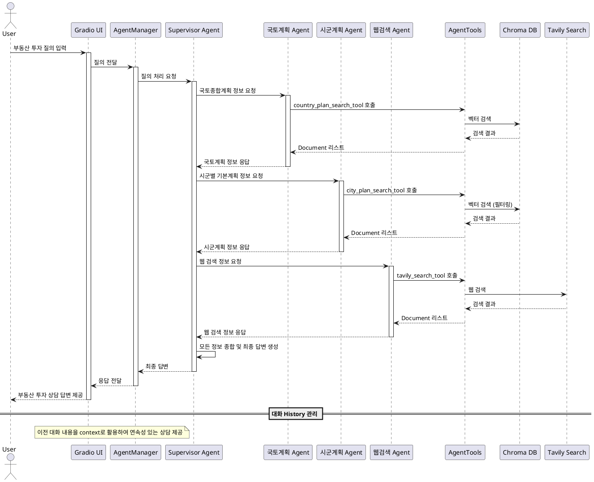
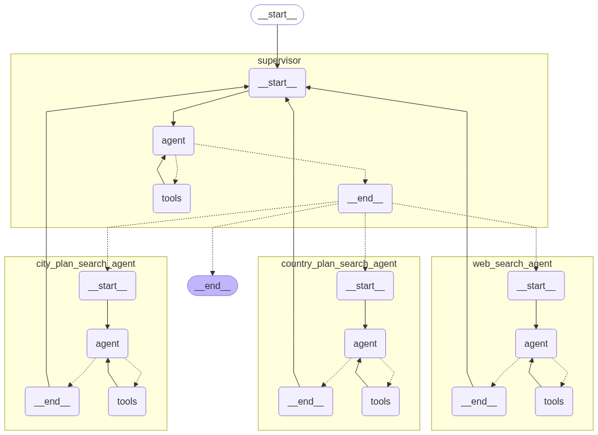

# Don-Worry 기획서

## I. 프로젝트 개요 (Don-Worry)

- 2020~2040 국토 종합개발계획 및 각 시군별 기본계획 문서를 기반으로 부동산·시설투자 관련 데이터를 수집·분석하여, RAG(검색증강생성) 기반의 LLM 챗봇을 개발함.
- 투자자, 건설사, 공공기관 담당자 등에게 실시간·상황 맞춤형 컨설팅을 제공하는 전문가용 챗봇 서비스 구축이 목표임.

## 문제 정의

- 6.27 부동산 정책으로 수도권의 투자는 당분간 힘들 전망
- 지방 부동산 가격은 2022년 하반기 부터 지속 하락한 상태이나 수도권 중심의 투자관점을 지방으로 옮기기에는 "투자지역 선정" 부터 "투자 기회 분석" 에 어려움이 있음
- 부동산 투자는 이러한 기반 정책 위에 새로운 규제 적용, 인구의 유출, 각종 지역적 변수를 기반으로 투자 적정성을 평가
- 매우 다양한 정책과 자료(시군단위 이하 지구단위 계획 등)를 광범위하고 객관적으로 종합하여 투자결정 하는것은 개인적으로는 불가능

## 솔루션

- 지방 균형발전을 위한 국가 차원의 중장기 계획과 이를 기반으로 한 시군구 단위의 도시 기본계획을 기반으로 분석하여 투자 기회를 발굴
- 기존 계획중인 투자 지역과 분류의 적정성을 검토해주고 관련 출처를 근거로 제시
- (향후) 더 많은 정책자료와 최신의 규제 업데이트, 지역 발행물 및 뉴스 등을 종합하여 투자 컨설팅 AI 개발로 가즈아~

## II. 프로젝트 범위(기능)

### 기존 계획중인 부동산/사업 지역투자 상담

아파트, 상가, 토지, 재개발, 재건축 등 내가 생각한 지역 부동산 투자에 대해 전망을 상담받음

### 향후 n 년 내의 전망 있는 지역 투자 상담

국가/시군 계획에 따라 시작과 완료 목표 일정을 참고하여 투자 시기 적절성 등을 평가하여 투자 지역과 물건 종류를 추천해줌

## III. SW 아키텍처

### 모듈 단위 SW 아키텍처 다이어그램 (Components)



### Multi Agent 처리 흐름



## IV. 사용 기술 Stack

| 분류                     | 주요 기술 및 라이브러리                        | 설명                                |
| ------------------------ | ---------------------------------------------- | ----------------------------------- |
| **LLM 엔진**       | OpenAI GPT-4.1-mini, Ollama Qwen3:0.6b         | 고급 자연어처리 및 답변 생성        |
| **RAG 파이프라인** | LangChain, LangGraph, LangGraph-Supervisor     | Retrieval-augmented Generation 구현 |
| **벡터 DB**        | Chroma                                         | 문서 임베딩 및 빠른 검색            |
| **임베딩 모델**    | BGE-M3 (Ollama), OpenAI text-embedding-3-small | 다국어 임베딩 생성                  |
| **웹 검색**        | Tavily Search                                  | 실시간 웹 정보 수집                 |
| **PDF 처리**       | Docling, PyPDF                                 | 고급/기본 PDF 텍스트 추출           |
| **챗봇 UI**        | Gradio                                         | 웹 기반 채팅 인터페이스             |
| **개발 환경**      | UV (Python 패키지 관리)                        | 빠른 의존성 관리 및 가상환경        |
| **언어**           | Python 3.12+                                   | 서비스 전체 구현 주력 언어          |

### 핵심 모듈 구조

```
src/
├── don_worry.py              # 메인 엔트리포인트
├── common/
│   ├── llm_factory.py        # LLM/임베딩 모델 팩토리
│   ├── dataload/
│   │   ├── pdf_loader.py     # PDF 처리 및 벡터DB 저장
│   │   └── docling_converter.py # 고급 PDF 텍스트 추출
│   └── agent/
│       ├── agent_manager.py  # Agent 관리 및 Supervisor
│       └── agent_tools.py    # 검색 도구들 (국토계획, 시군계획, 웹검색)
```

### 데이터베이스 구조

- **country_plan**: 국토종합계획 문서 (220개 청크)
- **city_plan**: 시				도군 기본계획 문서 (513개 청	크)
- **메타데이터**: agent_source, agent_name, city_name 등

### Agent 구조

- **Supervisor Agent**: 3개 전문 Agent 부려먹기
- **Country Plan Agent**: 국토종합계획 전문 검색 Agent (Vector DB, 별도 Collection)
- **City Plan Agent**:	 시도군 기본계획 전문 검색 Agent (Vector DB, 공용 Collection + 도시명 Meta 구분)
- **Web Search Agent**: 실시간 웹 정보 검색 (질문 지역 관련 뉴스나 현황 등을 추가로 검색)





## 실행 방법
1. uv 기반의 환경으로 구동 해야 함
```bash
# project 의 root 에서 아래 실행
$ uv sync
```

2. .env 내의 아래 설정값과 각족 OPEN API KEY 들을 확인한다

```bash
RESET_DB=false
COUNTRY_PLAN_PDF_DIR=raw_files/country_docs
CITY_PLAN_PDF_DIR=raw_files/city_docs
PDF_PROCESS_MODE=fast
```

!!주의!! `RESET_DB` 값은 AP 최초실행 시 `true` 로 하여 PDF 파일들을 임베딩 하여야 한다

3. 아래 커맨드로 실행 (혹은 VS Code 등에서 src/don_worry.py 실행)
```bash
$ uv run python src/don_worry.py
```

4. 브라우져로 http://localhost:7860 접속하여 대화

