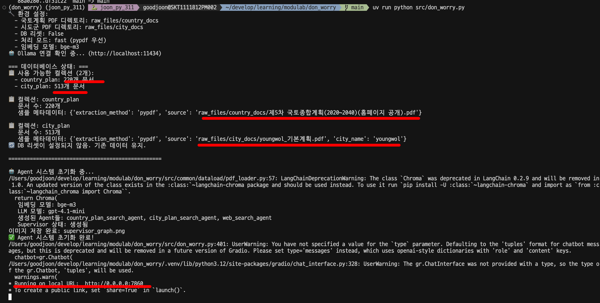
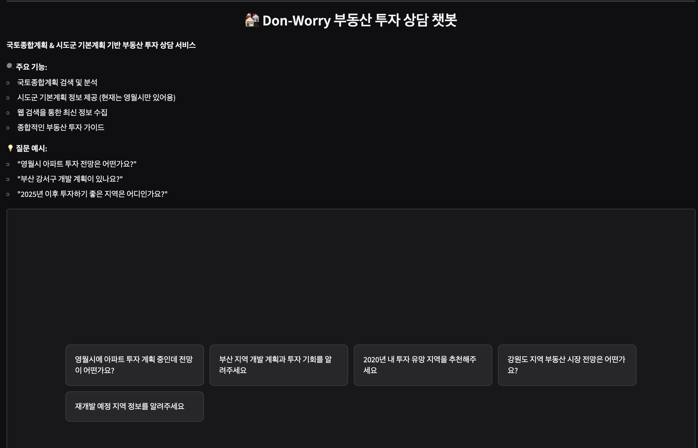
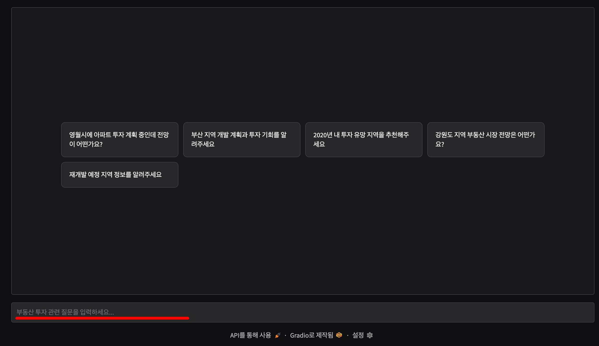
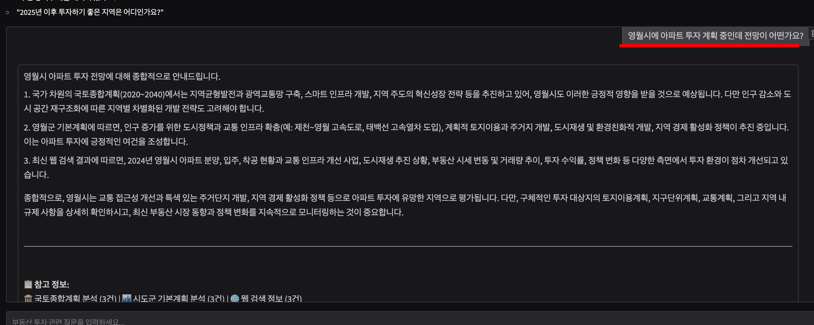
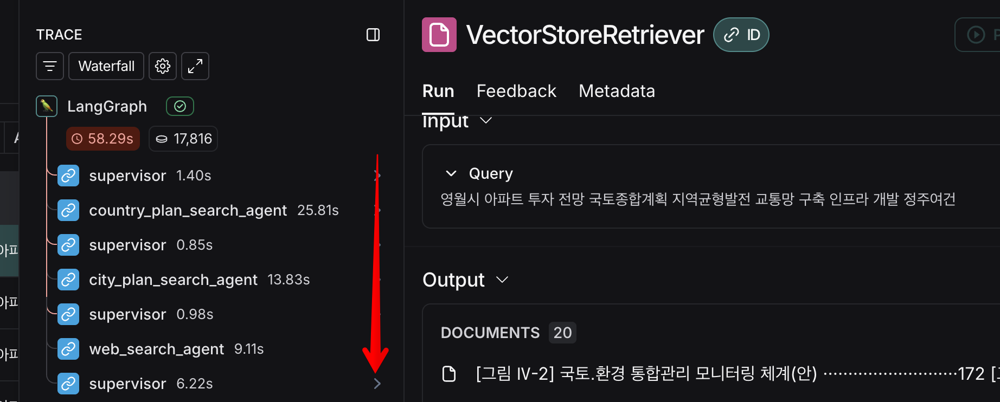
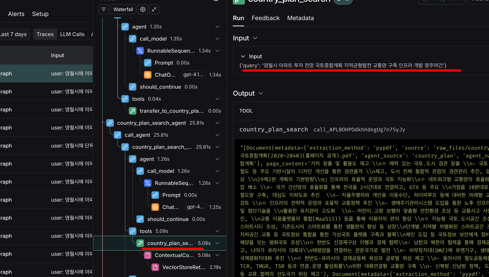
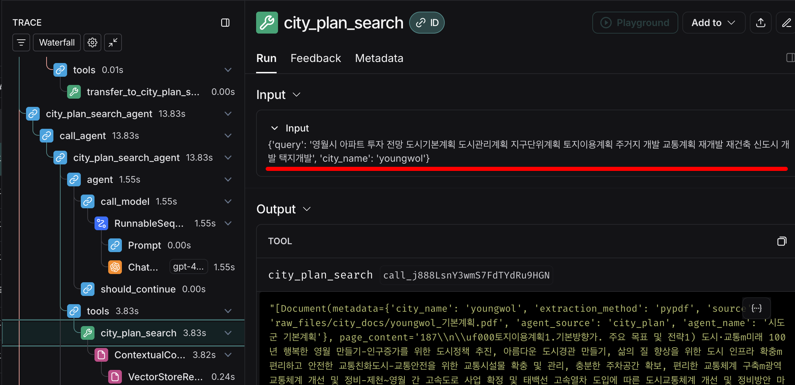

# 실행 시 동작 화면 설명

## 실행 시 Log

1. 실행하면 콘솔에 아래와 같이 출력 됩니다

- 기존에 DB 를 구성 하였다면 `.env` 파일에 `RESET_DB=false` 로 하여 DB 를 초기화 하지 않도록 유지합니다 
  

- 신규 구축해야 하는 경우라면, 위 밑줄친 경로 밑에 국토종합개발계획 PDF 와 `<영문지역명>`_기본계획 PDF 파일들을 넣고, RESET_DB=true 를 하고 실행 합니다

2. 웹 접속
- http://localhost:7860/ 에 접속합니다
  
  가운데에 있는 예시 문장을 선택하거나
  
  AI 에게 상담받고 싶은 질문을 던지면 됩니다
  
  위 처럼 국토종합개발계획 검색 -> 시군구별 기본계획 검색 -> 재종합 하여 결과를 내어줍니다. 각 Agent 가 Tool 을 사용할 때 질의를 증강하도록 하였습니다

3. LangSmith 
Lansmith 에 접속해서 요청 TRACE 를 해보면 아래 처럼 각 Multi Agent 들이 서로 실행되었음을 알 수 있습니다

각 Tool 을 실행하기 전에 Agent 가 
- 파라미터에 전달될 검색 질의를 증강하거나 
- 질의에서 지역명을 추출해 도구의 파라미터 값에 적합하도록 가공
하는 등의 작업이 이루어 졌음을 알 수 있습니다

